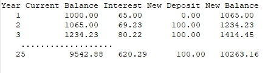
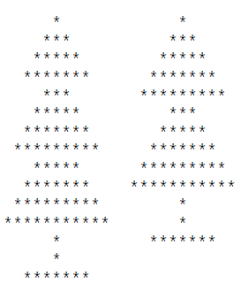

# 1. Object Oriented Programming in Java

## Presentations

* [Course Introduction](https://drive.google.com/open?id=1_3jEKE5G704tiqIlguuR-COGfCqYc2WH9utN0TzgZAQ)
* [Java OOP - Review](https://drive.google.com/open?id=1Ljr_Vj3huwZYTYQNSrZWjfU_5EtEqRcmeWrW_K0wmUo)
* [Collections Framework](https://drive.google.com/open?id=17rrk72cFgZOeTsusGFYOsT3ZuobMYWrX8q0e_OQNPTk)
  * [Set and Map video](https://drive.google.com/open?id=1en_dfd7lZBl3-OARGfmbFNFZMF5uAo6bOg)
  * [Phonebook example](https://drive.google.com/open?id=1YaOsRyfrqrtsQIgKT8MCbD2aQe9W255CTw)
  * [PhoneBook.java](src/demos/PhoneBook.java)
  
## Exercises

### Exercise 1.1 *

Solve the problem at the following link: 
[Print Square](https://practiceit.cs.washington.edu/problem/view/bjp4/chapter3/e4-printSquare). 
Note that if you register at the web site, you can test your solutions there.

### Exercise 1.2

Solve the problem at the following link: 
[Print Grid](https://practiceit.cs.washington.edu/problem/view/bjp4/chapter3/e5-printGrid). 
Note that if you register at the web site, you can test your solutions there. 

### Exercise 1.3

Solve the problem at the following link: 
[The name game](https://practiceit.cs.washington.edu/problem/view/bjp4/chapter3/e22-TheNameGame). 
Note that if you register at the web site, you can test your solutions there. 

### Exercise 1.4

A certain bank offers 6.5% interest on savings accounts, compounded annually. 
Create a table that shows how much money a person will accumulate over 
a period of 25 years, assuming that the person makes an 
initial investment of $1000 and deposits $100 each year 
after the first. Your table should indicate for each year the 
current balance, the interest, the new deposit, and the new 
balance. The output of the program should like something 
like this:

### Exercise 1.5*

Write a program that produces images of Christmas trees as 
output. It should have a method with two parameters: one 
for the number of segments in the tree and one for the height 
of each segment. For example, the tree shown here on the 
left has three segments of height 4 and the one on the right has two segments of height 5:

### Exercise 1.6

Solve the problem at the following link: 
[Max Length](https://practiceit.cs.washington.edu/problem/view/bjp4/chapter10/s8-maxLength). 
Note that if you register at the web site, you can test 
your solutions there. 

* [Exercise 1.6 Solution Video](https://drive.google.com/open?id=1RbuWEj82ix5gyatf5RQJeI84IyGTyUn01Q)
* [MaxLength.java](src/demos/MaxLength.java)

### Exercise 1.7

Solve the problem at the following link: 
[Min to Front](https://practiceit.cs.washington.edu/problem/view/bjp4/chapter10/e6-minToFront). 
Note that if you register at the web site, you can test your solutions there. 

### Exercise 1.8

Solve the problem at the following link: 
[Count Common](https://practiceit.cs.washington.edu/problem/view/bjp4/chapter11/e7-countCommon). 
Note that if you register at the web site, you can test your solutions there. 

### Exercise 1.9

Solve the problem at the following link: 
[Max Occurrences](https://practiceit.cs.washington.edu/problem/view/bjp4/chapter11/e15-maxOccurrences). 
Note that if you register at the web site, you can test your solutions there. 

* [Exercise 1.9 Solution Video](https://drive.google.com/open?id=1_6SgXcW6B8-3aBWEHYGl40B4HhrKiJhFCw)
* [MaxOccurrences.java](src/demos/MaxOccurrences.java)

### Exercise 1.10*

Solve the problem at the following link: 
[Rarest](https://practiceit.cs.washington.edu/problem/view/bjp4/chapter11/e19-rarest). 
Note that if you register at the web site, you can test your solutions there. 

