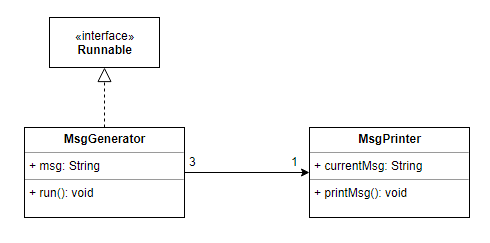

# 3. Threads in Java

## Presentations

* [3. Threads in Java](https://docs.google.com/presentation/d/172yzXyKV7n6T46kzF86PebODp7PrrJtqETPGDelJitw/edit?usp=sharing)

## Exercises

### Exercise 1 - Task

Write a program that creates a class called Task. Task will implement the Runnable interface. Create several threads using instances of Task and start them. Make the run method print some messages, so that you can observe how the thread executions are progressing.

### Exercise 2 - Message Printer

Create a class MsgPrinter, whose method printMsg(String msg) stores the message in the currentMsg field and then prints it. Create a class MsgGenerator that implements Runnable. The run method of MsgGenerator calls the printMsg of the MsgPrinter. Create three threads from three instances of MsgGenerator. Make each Thread print different message for example, thread 1 prints "You've", thread 2 prints "gotta", and thread 3 prints "kidding me!". Do the message generator threads require synchronization? 

**UML Diagram:**


### Exercise 3 - Message Channel

Write a simple message channel application. Create a MsgChannel class that can hold one message. Create one thread called MsgConsumer that takes the message from the channel and prints it. Create three threads using a class MsgProducer that put messages in the channel. We do not want messages to get overwritten and lost.

### Exercise 4 - Message Broadcast

Write a program, that allows you to broadcast messages to receiver threads. Create two message channels. Create three Receiver threads -- Receiver 1 and 2 will be waiting on channel 1 and Receiver 3 will be waiting on channel 2. Prompt the user to enter channel number and a message. Then show how the threads, waiting for messages from that channel receive the message, sent by the user. Below is a sample output of the program.

**Hint:** Here we have more than one receiver (consumer) per channel. That means the receiver cannot set the message to null since it needs to be available for the other receivers to get. Also, we cannot wait for null / non null message. We can use a message counter for synchronization.  

<details>
<summary>Sample output</summary>

````````
Receiver 3 waiting for message 1
Receiver 1 waiting for message 1
Receiver 2 waiting for message 1
Print a channel number and a message: 1 First message to channel 1
Putting message 1:  First message to channel 1
Receiver 1 got message 1:  First message to channel 1
Receiver 1 waiting for message 2
Receiver 2 got message 1:  First message to channel 1
Receiver 2 waiting for message 2
Receiver 1 waiting for message 2
Print a channel number and a message: 2 First message to channel 2
Putting message 1:  First message to channel 2
Receiver 3 got message 1:  First message to channel 2
Receiver 3 waiting for message 2
Print a channel number and a message: 1 Second message to channel 1
Putting message 2:  Second message to channel 1
Receiver 2 got message 2:  Second message to channel 1
Receiver 2 waiting for message 3
Receiver 1 got message 2:  Second message to channel 1
Receiver 1 waiting for message 3
Receiver 2 waiting for message 3
Print a channel number and a message: 2 Second message to channel 2
Putting message 2:  Second message to channel 2
Receiver 3 got message 2:  Second message to channel 2
Receiver 3 waiting for message 3
Print a channel number and a message: 
````````
</details>

### Exercise 5 - Bank Transfers

In package ex5 you will find a skeleton of a Bank application. The bank has a specified number of accounts. For each account in the bank, the application creates a thread that repeatedly transfers random amounts of money to randomly chosen accounts. In addition to printing every transaction, the application prints the total amount of money in all accounts. That amount should be constant and should not change. Our application however has a problem. First, the output is a little garbled, but even worse, the total amount of money changes. This means that money is getting lost somewhere. Examine the code and try to figure out the problem and fix it. 

### Exercise 6 - Improved Bank Transfers

Currently, the transfer method of the Bank class in Exercise 5 has the following code:
```
      if (accounts[from] < amount) return;
```
If the account does not have sufficient funds, then do not make the transaction and return. Improve the code by making it wait for somebody else to deposit money in the account and the funds become sufficient and then complete the transaction.